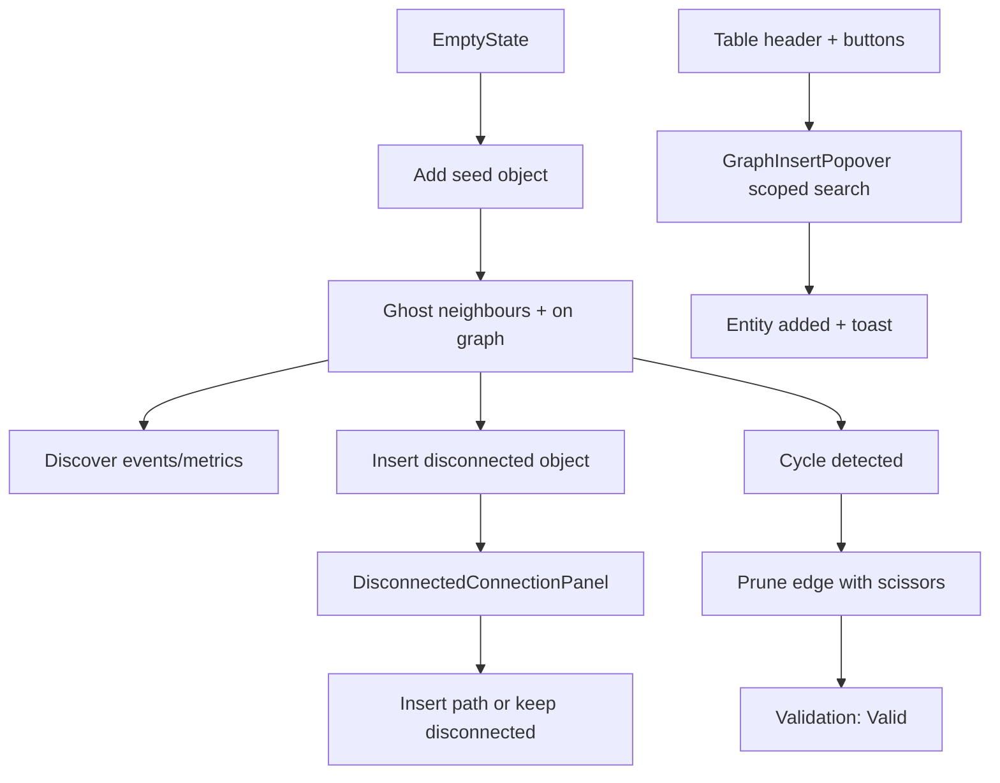
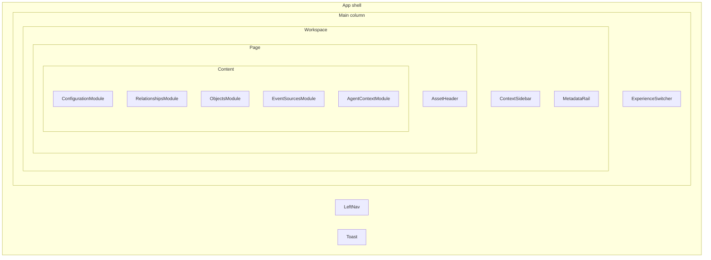

# Cursor Port Brief — Perspective Builder Prototype

> **Audience:** Cursor (or any engineer) porting or rebuilding this prototype inside the Celonis repo.  
> **Source:** Offline standalone app at project root. Read this before touching the codebase.

---

## 1. Purpose

This prototype explores a **graph-first Perspective configuration** experience for Celonis Semantic Types. The user configures a Perspective (scoped semantic graph of object types, relationships, event sources, and metrics) with the **graph as the primary editing surface**, not tables. The graph panel itself is visually grounded in the **MAKE Grid 2D view** from the Context Model explorer, but reimplements behaviour for building and validating a Perspective (see sections 5.1 and 5.2). The asset page shell (left nav, context sidebar, metadata rail, header) frames the experience but is static chrome.

This is an **offline standalone app**: React 19 + Vite + `@xyflow/react` + CSS Modules + mock data in [`src/data/mockData.js`](src/data/mockData.js). It is **not** wired to Celonis APIs, auth, routing, or the design system.

**When porting:** preserve product intent and interaction model first. Expect trial-and-error on design system integration, backend contracts, and asset page wiring. Interaction logic in hooks and utils should survive; presentation can be swapped.

---

## 2. Product scope

### In scope (preserve behavior)

- Graph as primary editing surface for Perspective configuration
- **MAKE Grid–inspired graph panel** (2D Context Model explorer visual language) with Perspective-specific interactions — see section 5.1
- **Adaptive graph layout** that reflows as the user builds — nodes must not overlap; edges should avoid crossings where possible — see section 5.2
- Progressive object expansion from a seed object via ghost neighbours
- Disconnected object insert with multi-hop route picker
- Cycle / route ambiguity detection and resolution (edge pruning)
- Discover events and metrics attached to included objects
- Summary validation strip (object / event / relationship counts + status pill)
- Asset tables below graph: Relationships, Objects, Event Sources — synced with graph state (these may exist already on the Celonis Context Model Perspective detail page)
- Bidirectional highlight: hover/focus table row highlights matching graph edge
- Insert popovers: canvas `+` and table header `+` buttons (scoped search per entity type)
- Toast feedback for all add/remove actions (undo on relationship prune)

### Out of scope / prototype-only

- Real persistence, save/load, deploy, versioning
- Agent context generation (static markdown in mock data)
- Left nav, context sidebar, metadata rail, asset header actions (visual chrome only)
- Pattern A "Keep this route" route cards — **built but not mounted** (see Known gaps)
- Backend validation, permissions, multi-user editing

---

## 3. Experience modes

Three tabs in the purple **Prototype experience** bar ([`ExperienceSwitcher.jsx`](src/components/layout/ExperienceSwitcher.jsx)):

| Tab label | Constant | Hook | Key difference |
|-----------|----------|------|----------------|
| **A — Discover toggles** | `EXPERIENCES.PROGRESSIVE` | `useProgressiveBuilder('global')` | Top-right discover filters (Objects / Events / Metrics) on the graph canvas |
| **A′ — Contextual menu** | `EXPERIENCES.PROGRESSIVE_CONTEXTUAL` | `useProgressiveBuilder('contextual')` | No global discover toggles. Click an included object → floating category menu with counts; pick a category to reveal that type from that node |
| **Cycle resolution demo** | `EXPERIENCES.ROUTE_AMBIGUITY` | `useRouteAmbiguity()` | Skips empty-state building. Pre-loaded Order-to-Cash graph with Customer → Delivery Item route conflict |

**Important:** Global and contextual progressive builders are **separate state instances** in [`App.jsx`](src/App.jsx). Tab switches preserve independent builds.

---

## 4. Core UX flows



### 4.1 Empty state → seed object

**Where:** [`EmptyState.jsx`](src/components/configuration/EmptyState.jsx) shown when `!progressive.hasStarted`.

**Flow:**
1. User sees suggested chips (Customer, Sales Order, etc.) or searches via `ObjectSearch`
2. Selecting an object calls `addObject()` → graph renders, toast confirms

**Acceptance:** First object appears on graph; summary strip shows 1 object; empty state disappears.

### 4.2 Connected add (ghost neighbours)

**Where:** [`PerspectiveNode.jsx`](src/components/graph/PerspectiveNode.jsx), [`objectDiscovery.js`](src/utils/objectDiscovery.js).

**Flow:**
1. After seed, ghost nodes appear as direct neighbours of the expansion anchor
2. User clicks `+` on a ghost node → object added to perspective
3. Expansion anchor follows last focused / clicked included node
4. Included nodes can be refocused (click to change expansion hub)

**Acceptance:** Ghost nodes only show addable neighbours not yet included. Toast on add. Table rows appear when endpoints are included.

### 4.3 Discover events and metrics

**Global mode (A):** Toggle Objects / Events / Metrics in top-right canvas controls ([`DiscoveryControls.jsx`](src/components/configuration/DiscoveryControls.jsx) via [`GraphCanvasControls.jsx`](src/components/graph/GraphCanvasControls.jsx)).

**Contextual mode (A′):** Click included object → [`ContextualDiscoveryMenu.jsx`](src/components/graph/ContextualDiscoveryMenu.jsx) shows category counts → reveal events/metrics as satellite ghost nodes ([`graphDiscoveryNodes.js`](src/utils/graphDiscoveryNodes.js)).

**Acceptance:** Event/metric ghosts only appear when discover is on and parent object is included. Add via `+` on ghost or insert popover.

### 4.4 Disconnected add + route picker

**Where:** [`DisconnectedConnectionPanel.jsx`](src/components/configuration/DisconnectedConnectionPanel.jsx), [`graphPaths.js`](src/utils/graphPaths.js), [`useProgressiveBuilder.js`](src/hooks/useProgressiveBuilder.js) `addObject()`.

**Triggered when:** Adding an object that does not touch any included object (`objectTouchesIncluded`), or when insert search passes `options.disconnected: true`.

**Demo objects:**
- **Vendor Hub** — `insertOnly: true`, `demoDisconnectedRoutes: true`. Not a ghost neighbour. Insert via search/popover only. Shows 4 curated routes (3 clean, 1 creates cycle). Hover path → preview on graph; click → insert path.
- **Currency Conversion** — `disconnected: true`, no model paths. Can only be added as fully disconnected ("Keep disconnected").

**Acceptance:** Route picker panel appears below graph. Preview highlights path edges/objects. Pending object shown in `pending` state until connected or kept disconnected.

### 4.5 Cycle / route ambiguity detection and resolution

**Where:** [`cycleDetection.js`](src/data/cycleDetection.js), [`GraphCycleOverlay.jsx`](src/components/graph/GraphCycleOverlay.jsx), [`RouteEdge.jsx`](src/components/graph/RouteEdge.jsx).

**Classic demo loop:** Include Customer, Sales Order, Delivery, Delivery Item → two routes to Delivery Item exist:
- **Route A:** Customer → Delivery Item (`r-customer-di`)
- **Route B:** Customer → Sales Order → Delivery → Delivery Item (`r-customer-so`, `r-so-delivery`, `r-delivery-di`)

**When cycle active:**
- Validation pill → **Needs resolution** ([`SummaryStrip.jsx`](src/components/configuration/SummaryStrip.jsx))
- Amber overlay banner on graph
- Cycle edges show scissors (✂) for pruning
- Discovery disabled; graph locks to included-only nodes
- Relationship table gains alert banner + "In loop" column

**Resolution (Pattern B — active):** Click ✂ on an edge → `pruneRelationship()` → toast with undo.

**Acceptance:** After pruning one route edge, validation becomes **Valid**. Graph and tables update.

### 4.6 Table insert via header + buttons

**Where:** [`TableSectionHeader.jsx`](src/components/asset/TableSectionHeader.jsx) → [`GraphInsertPopover.jsx`](src/components/graph/GraphInsertPopover.jsx) → [`InsertSearchPanel.jsx`](src/components/configuration/InsertSearchPanel.jsx).

**Enabled in:** Progressive modes only (`showAdd={isProgressiveExperience}` in [`App.jsx`](src/App.jsx)).

| Table | `lockedScope` | Handler |
|-------|---------------|---------|
| Objects | `object` | `progressive.addObject` |
| Event Sources | `event` | `progressive.addEvent` |
| Relationships | `relationship` | `progressive.addRelationship` (includes both endpoint objects) |

**Acceptance:** Click `+` on section header → scoped popover opens → search → select → entity added, table row appears, toast confirms.

### 4.7 Canvas insert popover

**Where:** Top-left of graph when `showInsertPopover={isProgressive && progressive.hasStarted}` and no cycle overlay.

**Behavior:** Multi-scope search (All / Objects / Events / Relationships / Metrics). Vendor Hub prioritized when disconnected options enabled. Hidden during active cycle overlay.

### 4.8 Table ↔ graph highlight

**Where:** `highlightedRelationshipId` state in [`App.jsx`](src/App.jsx).

**Flow:** Hover or focus a relationship table row → matching edge highlights on graph (`highlightFromTable` in [`RouteEdge.jsx`](src/components/graph/RouteEdge.jsx)).

---

## 5. Layout and page structure



**Configuration module** ([`ConfigurationModule.jsx`](src/components/configuration/ConfigurationModule.jsx)):
- Summary strip (counts + validation)
- Perspective graph canvas
- Disconnected connection panel (when route picker active)

### 5.1 Graph panel: MAKE Grid lineage (visual vs behavioural)

The graph canvas is **closely based on the 2D view of the MAKE Grid graph** that forms the basis of the **Context Model explorer**. When porting, treat this as a visual and structural reference point — not a drop-in component.

**What to inherit from MAKE Grid / Context Model explorer:**
- Pedestal-style object nodes on a dot-grid canvas ([`MakeGridBackdrop.jsx`](src/components/graph/MakeGridBackdrop.jsx), [`PerspectiveNode.jsx`](src/components/graph/PerspectiveNode.jsx))
- Object / event / metric node iconography and type differentiation
- Relationship edges as routed lines between semantic entities ([`RouteEdge.jsx`](src/components/graph/RouteEdge.jsx))
- Overall “explore a semantic model on a grid” aesthetic — see [`ReferenceImages/`](ReferenceImages/) for MakeGrid and asset-page context

**What this prototype changes (behaviour and interactions):**
- The graph is an **editing surface**, not read-only exploration
- **Ghost nodes** with `+` affordances for progressive inclusion
- **Discover controls** (global toggles or contextual category menu) to reveal addable events/metrics
- **Insert popovers** on canvas and table headers
- **Disconnected insert** with multi-hop route preview and connection picker
- **Cycle / route ambiguity** overlay, edge pruning (scissors), validation lock during conflict
- **Bidirectional sync** with asset tables (highlight, counts, status)
- **Show only included** filter and manual **Auto layout** rerun

**Porting implication:** Reuse MAKE Grid 2D styling and node/edge primitives where the Celonis repo exposes them, but expect to **implement or extend interaction logic** separately. Do not assume Context Model explorer behaviour transfers unchanged.

### 5.2 Adaptive graph layout (task-driven reflow)

A core product requirement: **as the user iterates their Perspective, the graph layout should update to support the current task.** Relationship lines between objects, events, and metrics should **not overlap each other when possible**. **Nodes must not overlap.**

This is a layout *intent* — the prototype achieves it with custom layout utilities on top of React Flow, not by delegating to MAKE Grid (capabilities of MAKE Grid 2D layout APIs are **unknown / unverified** in this offline build).

**When layout recalculates** ([`PerspectiveGraph.jsx`](src/components/graph/PerspectiveGraph.jsx)):
- Included set changes (objects, events, metrics added or removed)
- Discover visibility toggles (ghost nodes appear/disappear)
- Cycle state changes (cycle square layout, route-resolve top inset)
- Disconnected path preview (bridge objects/edges highlighted)
- User clicks **Auto layout** (`layoutEpoch` force — clears saved positions)
- Lighter **relationships-only** pass when only pruning or highlight state changes (preserves node positions)

**Layout strategies in the prototype:**

| Scenario | Layout behaviour | Primary file |
|----------|-------------------|--------------|
| Single seed (Sales Order) + ghosts | Hub ring around focal node | [`demoLayout.js`](src/utils/demoLayout.js) |
| Linear O2C chain | Horizontal chain positioning | `demoLayout.js` |
| Cycle detected | Fixed cycle square (Customer, Delivery Item, Sales Order, Delivery) | `demoLayout.js` |
| Route ambiguity demo | Pre-set positions for conflicting routes | `demoLayout.js`, [`buildGraphElements.js`](src/utils/buildGraphElements.js) |
| General expansion | Fan ring + ghost placement near anchor | [`graphAutoLayout.js`](src/utils/graphAutoLayout.js) |
| Events / metrics | Satellite lanes below parent objects | `demoLayout.js` (`ENRICHMENT_LANE_GAP`) |

**Overlap and crossing avoidance:**
- **Node–node:** `resolveOverlaps()` and `resolveNodeCollisions()` push nodes apart with minimum margins ([`demoLayout.js`](src/utils/demoLayout.js), [`graphAutoLayout.js`](src/utils/graphAutoLayout.js))
- **Node–edge:** `avoidEdgeNodeOverlap()` pushes nodes away from relationship lines they are not part of ([`graphEdgeLayout.js`](src/utils/graphEdgeLayout.js))
- **Edge–edge:** `reduceEdgeCrossings()` nudges endpoints when segments intersect (`graphEdgeLayout.js`)
- **Handle selection:** `enrichEdgesWithHandles()` picks top/right/bottom/left handles per edge to shorten paths and reduce visual clutter ([`edgeHandles.js`](src/utils/edgeHandles.js))

**Motion and persistence:**
- **480ms animated transitions** when topology changes (`animateNodesToTargets` in [`animateGraph.js`](src/utils/animateGraph.js))
- **Dragged positions saved** in `savedPositions` ref until force re-layout or topology-driven clear
- **Viewport auto-fit** frames included + visible ghost nodes; special hub-ring framing for Sales Order seed ([`graphViewport.js`](src/utils/graphViewport.js))
- **Snap-to-grid** on manual drag stop ([`graphGrid.js`](src/utils/graphGrid.js))

**Acceptance criteria for port:**
1. Adding nodes never leaves two nodes visually stacked on top of each other
2. Layout visibly reflows when perspective membership changes (not a static canvas)
3. Edge routes adapt (handle sides / paths) as nodes move
4. Cycle and route-conflict states use readable, non-overlapping arrangements
5. User can manually reposition nodes; positions persist until auto-layout or major topology change

**Open question for Celonis integration:** Can MAKE Grid 2D reuse or expose layout engines that satisfy the above? If not, port the custom layout layer (`demoLayout`, `graphAutoLayout`, `graphEdgeLayout`) alongside MAKE Grid visuals.

**Graph container height** ([`PerspectiveGraph.module.css`](src/components/graph/PerspectiveGraph.module.css)):
- Default: **540px** (reduced 10% from original 600px)
- Cycle overlay active: **576px** (was 640px)

**Reference visuals:** [`ReferenceImages/`](ReferenceImages/) — current asset page, MakeGrid graph, historical builder, cycle resolution context.

---

## 6. Implementation map

| Concern | Primary file(s) |
|---------|-----------------|
| App shell and mode routing | [`src/App.jsx`](src/App.jsx) |
| Progressive builder state | [`src/hooks/useProgressiveBuilder.js`](src/hooks/useProgressiveBuilder.js) |
| Route ambiguity demo state | [`src/hooks/useRouteAmbiguity.js`](src/hooks/useRouteAmbiguity.js) |
| Toast notifications | [`src/hooks/useToast.js`](src/hooks/useToast.js) |
| Mock domain model | [`src/data/mockData.js`](src/data/mockData.js) |
| Cycle detection | [`src/data/cycleDetection.js`](src/data/cycleDetection.js) |
| Graph element build | [`src/utils/buildGraphElements.js`](src/utils/buildGraphElements.js) |
| Graph layout and collision avoidance | [`src/utils/demoLayout.js`](src/utils/demoLayout.js), [`src/utils/graphAutoLayout.js`](src/utils/graphAutoLayout.js), [`src/utils/graphEdgeLayout.js`](src/utils/graphEdgeLayout.js) |
| Edge handle routing | [`src/utils/edgeHandles.js`](src/utils/edgeHandles.js) |
| Viewport framing | [`src/utils/graphViewport.js`](src/utils/graphViewport.js) |
| Node motion / animation | [`src/utils/animateGraph.js`](src/utils/animateGraph.js) |
| MAKE Grid backdrop (decorative) | [`src/components/graph/MakeGridBackdrop.jsx`](src/components/graph/MakeGridBackdrop.jsx) |
| Disconnected path finding | [`src/utils/graphPaths.js`](src/utils/graphPaths.js) |
| Object discovery neighbours | [`src/utils/objectDiscovery.js`](src/utils/objectDiscovery.js) |
| React Flow canvas | [`src/components/graph/PerspectiveGraph.jsx`](src/components/graph/PerspectiveGraph.jsx) |
| Custom node / edge | [`PerspectiveNode.jsx`](src/components/graph/PerspectiveNode.jsx), [`RouteEdge.jsx`](src/components/graph/RouteEdge.jsx) |
| Insert search and popover | [`InsertSearchPanel.jsx`](src/components/configuration/InsertSearchPanel.jsx), [`GraphInsertPopover.jsx`](src/components/graph/GraphInsertPopover.jsx) |
| Relationship table view | [`src/utils/perspectiveRelationships.js`](src/utils/perspectiveRelationships.js) |
| Object / event table rows | [`src/utils/perspectiveEntities.js`](src/utils/perspectiveEntities.js) |
| Configuration orchestration | [`ConfigurationModule.jsx`](src/components/configuration/ConfigurationModule.jsx) |
| Asset tables | [`RelationshipsModule.jsx`](src/components/asset/RelationshipsModule.jsx), [`ObjectsModule.jsx`](src/components/asset/ObjectsModule.jsx), [`EventSourcesModule.jsx`](src/components/asset/EventSourcesModule.jsx) |

### State model

No external store. Custom hooks with React `useState` / `useMemo` / `useCallback`.

**Core Sets in `useProgressiveBuilder`:**
- `includedObjects`, `includedEvents`, `includedMetrics` — perspective membership
- `prunedRelationshipIds` — soft-deleted relationships

**Key derived state:**
- `activeRelationships` — all relationships minus pruned
- `cycleActive`, `cycleEdgeIds` — cycle detection
- `addableObjects`, `addableEvents`, `addableMetrics` — discoverable ghosts
- `includedRelationshipIds` — relationships where both endpoints are included
- `validationStatus` — Incomplete / Needs resolution / Valid
- `connectionPrompt`, `previewBridgePathId` — disconnected add flow

**App-level state:**
- `experience` — active mode tab
- `highlightedRelationshipId` — table ↔ graph sync

---

## 7. Data model essentials

All mock data in [`src/data/mockData.js`](src/data/mockData.js). Domain: **Order to Cash** perspective.

### Objects (13)

Core chain: Customer, Sales Order, Sales Order Item, Delivery, Delivery Item, Invoice, Invoice Item, Product, Material, Plant.

Special objects:

| Object | Flags | Behavior |
|--------|-------|----------|
| Returns Processing | `hiddenFromDiscovery: true` | Not shown as ghost neighbour |
| Vendor Hub | `insertOnly: true`, `demoDisconnectedRoutes: true` | Insert-only; 4 curated multi-hop routes after search |
| Currency Conversion | `disconnected: true`, `relationshipCount: 0` | Truly isolated; no model paths |

### Relationships (19)

Directed edges: `{ id, source, target, label }`.

Ambiguity pair (cycle demo):
- Route A: `r-customer-di` (Customer → Delivery Item)
- Route B: `r-customer-so` → `r-so-delivery` → `r-delivery-di`

Vendor Hub fan-out: Material, Plant, Product, Returns Processing.

### Event sources (7) + eventLinks

Linked to Sales Order, Delivery, Invoice objects.

### Metrics (5) + metricLinks

On-time Delivery (Delivery), Order Value / Touchless Order Rate / Order Cycle Time (Sales Order), Outstanding Revenue (Invoice).

### Display metadata

- `relationshipTableMeta` — table column values (name, cardinality, join key, type)
- `ROUTE_A` / `ROUTE_B` — route card metadata (for unwired Pattern A UI)
- `routeAmbiguityIncluded` — pre-loaded object set for cycle resolution demo
- `assetMetadata`, `agentContextMarkdown` — static rail / agent content

---

## 8. UX and accessibility notes

When porting, preserve these interaction patterns even if visual components change:

- **ARIA:** `aria-label`, `aria-expanded`, `role="dialog"` on popovers, `role="tablist"` on experience switcher, `role="alert"` on cycle banner
- **Keyboard:** Escape closes popovers; table rows are focusable for highlight sync
- **Toasts:** 2.8s default; 8s with undo button on relationship prune
- **Validation pill:** Incomplete (grey) → Needs resolution (amber) → Valid (green)
- **Type indicators:** [`TypeIndicator.jsx`](src/components/shared/TypeIndicator.jsx) — object, event source, metric badges in nodes and tables
- **Empty states:** Italic placeholder rows in tables with guidance copy
- **Count badges:** Section headers show in-perspective count
- **MAKE Grid visual language:** See section 5.1 — pedestal nodes, dot grid backdrop ([`MakeGridBackdrop.jsx`](src/components/graph/MakeGridBackdrop.jsx)). Behaviour differs from Context Model explorer.
- **Adaptive layout:** See section 5.2 — layout reflows with perspective changes; overlap/crossing avoidance is a product requirement.

---

## 9. Recent iterations (do not lose on port)

Changes from the build session that refined the prototype:

1. **Table header + buttons** — `+` on Objects, Event Sources, and Relationships section headers. Reuses `GraphInsertPopover` with `variant="header"`, `align="right"`, and `lockedScope` per table. Relationship insert via `addRelationship()` adds both endpoint objects and restores pruned relationship if needed.

2. **Graph height reduced 10%** — 540px default, 576px during cycle overlay (was 600px / 640px).

3. **InsertSearchPanel extended** — Relationships scope added with purple badge styling (`.kindRelationship`). Scope chips hidden when `lockedScope` is set (table popovers).

4. **GraphInsertPopover generalized** — Supports `lockedScope`, `variant`, `align`, custom hints/placeholders for canvas vs table contexts.

---

## 10. Known gaps and unwired code

These files exist but are **not mounted** in the current UI. Decide whether to wire, port, or drop:

| File | Purpose | Status |
|------|---------|--------|
| [`RouteAmbiguityPanel.jsx`](src/components/configuration/RouteAmbiguityPanel.jsx) | Pattern A "Keep this route" cards | Not imported in App |
| [`GraphRouteAmbiguityOverlay.jsx`](src/components/graph/GraphRouteAmbiguityOverlay.jsx) | Route overlay with Pattern A/B switch | Not imported in App |
| [`AdvancedDetailsPanel.jsx`](src/components/configuration/AdvancedDetailsPanel.jsx) | Technical fallback details | Not imported in App |
| [`TestingGuide.jsx`](src/components/layout/TestingGuide.jsx) | Collapsible step-by-step test instructions | Not imported in App |

**Active resolution pattern:** Pattern B only (scissors / edge pruning). Pattern A route cards are documented in TestingGuide but not reachable in the live UI.

---

## 11. Porting guidance for Celonis repo

### Replace, preserve, adapt

| Layer | Prototype | Celonis target |
|-------|-----------|----------------|
| Data | `mockData.js` | Semantic Types / Perspective API |
| Styling | CSS Modules | Celonis design system components |
| Graph library | `@xyflow/react` v12 | Likely keep; re-skin nodes/edges to MAKE Grid / DS tokens |
| Graph visuals | Custom CSS + MakeGrid backdrop | Prefer MAKE Grid 2D components from Context Model explorer where available |
| Graph layout | Custom `demoLayout` + `graphAutoLayout` + `graphEdgeLayout` | **Validate MAKE Grid layout APIs first.** If insufficient, port custom layout layer — see section 5.2 |
| State | Custom hooks + Sets | Preserve shape; adapt to API responses |
| Chrome | Static JSX | Real nav, sidebar, metadata from app shell |

### Suggested port order

1. **Data hooks + validation** — `useProgressiveBuilder` logic, cycle detection, path finding
2. **Graph build/layout utils** — `buildGraphElements`, `demoLayout`, `graphAutoLayout`, `graphEdgeLayout`, viewport (no UI yet). Confirm overlap/crossing behaviour matches section 5.2 acceptance criteria.
3. **PerspectiveGraph + nodes/edges** — React Flow canvas with MAKE Grid–styled custom node/edge components
4. **Configuration panels** — empty state, summary strip, disconnected panel, discover controls
5. **Asset tables** — Relationships, Objects, Event Sources with insert popovers
6. **Asset page chrome** — wire into real Celonis layout last

### State shape to preserve

```javascript
// Core membership
includedObjects: Set<string>
includedEvents: Set<string>
includedMetrics: Set<string>
prunedRelationshipIds: Set<string>

// Derived
validationStatus: 'Incomplete' | 'Needs resolution' | 'Valid'
cycleActive: boolean
includedRelationshipIds: Set<string>
```

Map API responses into these Sets early so graph and table logic ports with minimal changes.

### Test journeys for parity

Run these after each port milestone:

**Journey 1 — Progressive build + cycle + resolve + disconnected insert**
1. Start with Sales Order
2. Add Customer, Delivery, Delivery Item via ghost `+` buttons
3. Confirm "Needs resolution" status and cycle overlay
4. Prune one route edge with scissors
5. Confirm "Valid" status
6. Insert Vendor Hub via canvas or table `+` → preview routes → connect
7. Confirm one route shows "Creates cycle" warning

**Journey 2 — Route ambiguity shortcut**
1. Switch to "Cycle resolution demo" tab
2. Confirm pre-loaded graph with conflict
3. Prune edge → valid

**Journey 3 — Table insert buttons**
1. In progressive mode, use `+` on Objects table header → add object
2. Use `+` on Event Sources → add event
3. Use `+` on Relationships → add relationship (both endpoints included)

**Journey 4 — Contextual discovery (A′ tab)**
1. Switch to "A′ — Contextual menu"
2. Build a small graph
3. Click included node → category menu → reveal events/metrics

**Journey 5 — Table ↔ graph highlight**
1. Hover relationship table rows
2. Confirm matching edge highlights on graph

**Journey 6 — Adaptive layout**
1. Add Sales Order → confirm hub-ring ghost layout
2. Add Customer, Delivery, Delivery Item → confirm layout reflows without node overlap
3. Trigger cycle → confirm cycle square layout and readable dual routes
4. Drag a node manually → confirm position persists until Auto layout or major add
5. Click Auto layout → confirm positions reset and graph reframes

---

## 12. How to run (reference)

**Requires Node.js.** Do not open `index.html` directly — it will be blank.

```bash
cd PerspectiveBuilder
npm install
npm run dev
```

Open **http://127.0.0.1:5199/** ([`vite.config.js`](vite.config.js) — port 5199, strict).

**macOS shortcut:** double-click [`Start Prototype.command`](Start%20Prototype.command).

See also [`HOW_TO_RUN.txt`](HOW_TO_RUN.txt) and [`START HERE.txt`](START%20HERE.txt).

---

## 13. Stack summary

| Dependency | Version | Role |
|------------|---------|------|
| React | 19 | UI |
| Vite | 6 | Dev server and build |
| `@xyflow/react` | 12 | Graph canvas |
| CSS Modules | — | Component styling |

No Tailwind, no shadcn, no backend, no test suite in this prototype.

---

## 14. File structure quick reference

```
src/
├── App.jsx                          # Shell, experience routing, table data
├── main.jsx                         # React root + ErrorBoundary
├── data/
│   ├── mockData.js                  # All domain entities
│   ├── cycleDetection.js            # Cycle / shortest-path edge detection
│   └── graphLayout.js               # Neighbours, focal object
├── hooks/
│   ├── useProgressiveBuilder.js     # Main builder state
│   ├── useRouteAmbiguity.js         # Pre-loaded cycle demo
│   └── useToast.js                  # Toast + undo
├── utils/                           # Graph build, layout, paths, entities
├── components/
│   ├── layout/                      # Nav, sidebar, header, rail, switcher
│   ├── configuration/               # Config module, panels, search
│   ├── graph/                       # React Flow, nodes, edges, overlays
│   ├── asset/                       # Tables below graph
│   ├── shared/                      # TypeIndicator
│   └── ui/                          # Toast, ErrorBoundary
└── styles/global.css
```

---

*Last updated from offline prototype build session. Use this brief as the single source of truth when prompting Cursor to port or rebuild in the Celonis repo.*
